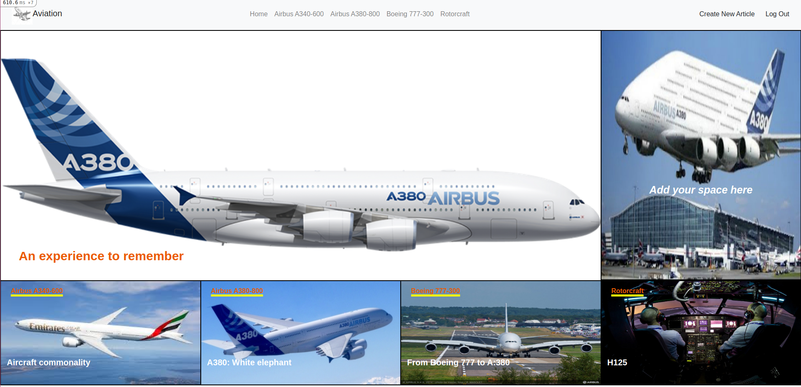

# AirCraft Magazine

> This project represent my Rails Capstone Project. It is magazine about aircrafts, build with Rails and styled with Bootstrap.

## Live Version

- https://murmuring-island-95031.herokuapp.com/

## Built With

- Ruby
- Ruby on Rails
- Bootstrap

## Getting Started

**First get a copy of the project by clicking on the green button on the top right corner**
**On your local machine run this command `git clone git@github.com:410AngelaVu/Articles.git`**
**Then type `cd Articles` and that will get you inside the project.**
**Then run bundle install**
**Run db:migrate**
**Run db:seed**
**Sign Up**
**To open in server, go to the browser and type localhost:3000**

## To install Bootstrap in Rails:

- Go to your Terminal and put this:

- yarn add bootstrap jquery popper.js

### Prerequisites

- Need to have Ruby install
- Rails

### Usage

- Sign Up to a new account and read exciting articles!

## Authors

👤 **Gia Vu**

- GitHub: [https://github.com/410AngelaVu]
- Twitter: [https://twitter.com/andjelavukadin7]
- LinkedIn: [https://www.linkedin.com/in/andjela-vukadinovic-67a21b1b2/]

## Acknowledgments

- [Microverse](https://www.microverse.org/).
- [The Odin Project](https://www.theodinproject.com/).
- Design idea by [Nelson Sakwa on Behance](https://www.behance.net/sakwadesignstudio)
